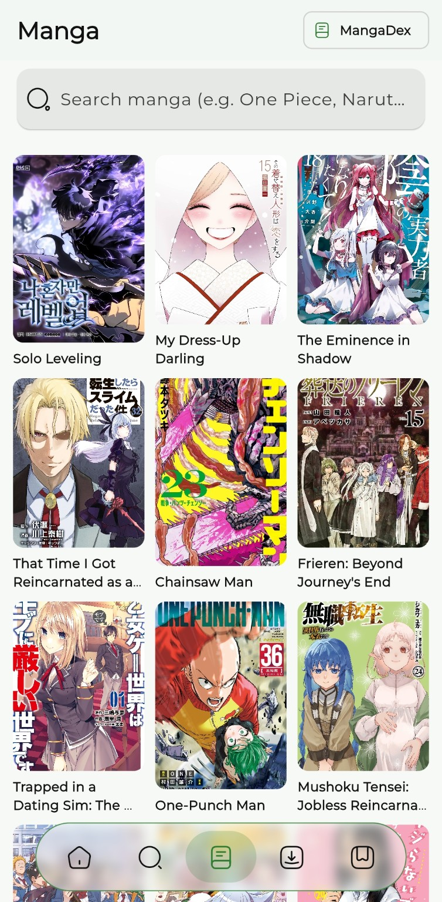
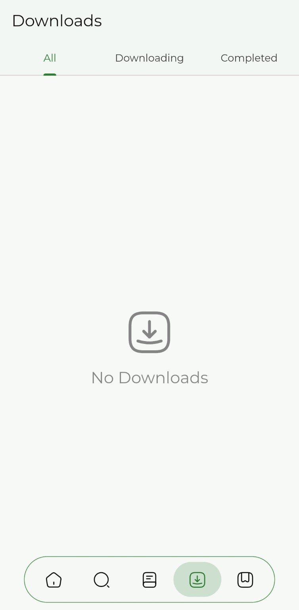
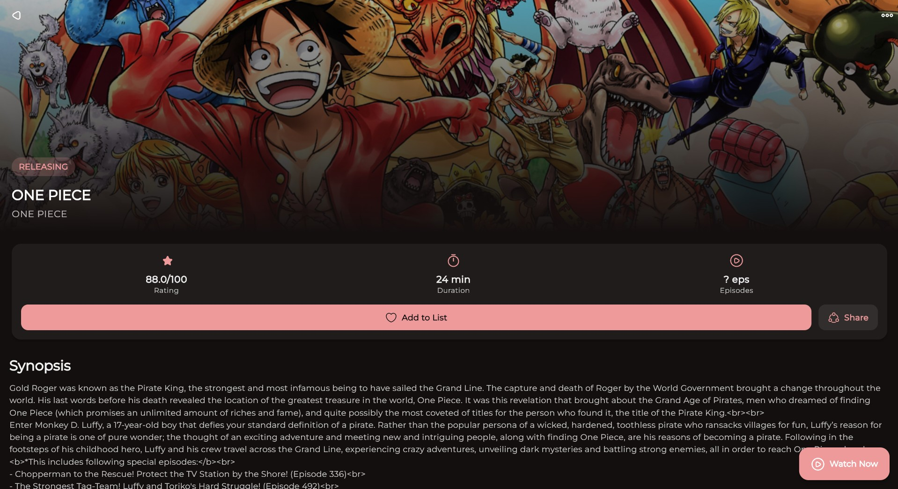
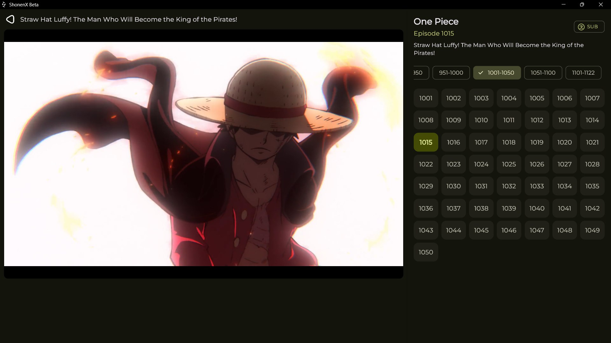

<div align="center">


# AniDash

### Discover, watch, download, and keep track of anime in one place.

[](https://github.com/anshdeepofficial1/AniDash/releases/latest)
[](https://github.com/anshdeepofficial1/AniDash/releases)
[](LICENSE.md)

<a href="https://github.com/anshdeepofficial1/AniDash/releases/latest"></a>

</div>

## What is AniDash?

AniDash is an anime companion for Android. It gives you a simple place to find anime, watch available episodes, download episodes for offline viewing, continue where you stopped, and manage your library.

You can use AniDash without connecting an account. If you want your anime list available across devices, you can also connect AniList.

## See AniDash in action

<p align="center">
  
  
  
</p>

<p align="center">
  <strong>Home and Continue Watching</strong>&nbsp;&nbsp;•&nbsp;&nbsp;
  <strong>Discover and Search</strong>&nbsp;&nbsp;•&nbsp;&nbsp;
  <strong>Your Library</strong>
</p>

<p align="center">
  
  
</p>

<p align="center">
  <strong>Manga with MangaDex</strong>&nbsp;&nbsp;•&nbsp;&nbsp;
  <strong>Offline Downloads</strong>
</p>

### Desktop layout preview

<p align="center">
  
  
</p>

> Screens can look slightly different depending on your device, theme, selected layout, and app version.

## What you can do

- **Watch online** — choose an available episode and watch it in the built-in player.
- **Choose SUB or English DUB** — AniDash keeps your selected language when that version is available.
- **Download for later** — save complete episodes and watch them without an internet connection.
- **Continue from where you stopped** — progress is shared between online and downloaded playback.
- **Discover anime** — browse trending, popular, recently updated, and upcoming titles.
- **Search quickly** — find series and movies and view their available details and episodes.
- **Understand a series before watching** — see the synopsis, rating, episode information, available languages, characters, and watch order when data is available.
- **Spot filler episodes** — supported episode lists can highlight filler content and help you skip it.
- **Manage your library** — keep Watching, Completed, Planning, Paused, and Dropped lists locally or with AniList.
- **Read manga** — browse and read supported manga through MangaDex.
- **Personalize the app** — choose light or dark mode, colors, card styles, banner styles, and player preferences.
- **Stay informed** — control update, release, Continue Watching, and download notifications separately.

## Install on Android

1. Open the **[latest AniDash release](https://github.com/anshdeepofficial1/AniDash/releases/latest)**.
2. Download the newest file ending in `.apk`.
3. Open the downloaded file.
4. If Android asks, allow installation from your browser or file manager.
5. Install AniDash and open it.

When an update is available, you can install the newer APK over the existing app. Your local app data should remain available as long as the package is updated normally instead of being uninstalled first.

## A few useful notes

- Streaming and episode availability depend on the selected source and your connection.
- If one source is temporarily unavailable, try another installed source from the source selector.
- Downloads use device storage, so make sure enough free space is available.
- AniList sign-in is optional. Local history and Continue Watching work without it.
- AniDash does not include or host anime or manga files.

## Need help or found a bug?

Open a **[GitHub issue](https://github.com/anshdeepofficial1/AniDash/issues)** and include:

- your AniDash version;
- your Android version and phone model;
- the anime, movie, or episode name;
- the selected source and SUB/DUB choice;
- a screenshot or short screen recording, if possible.

These details make playback and source problems much easier to reproduce and fix.

## For contributors

<details>
<summary>Build AniDash from source</summary>

You need a compatible Flutter SDK and the Android or desktop development tools for your platform.

```bash
git clone https://github.com/anshdeepofficial1/AniDash.git
cd AniDash
flutter pub get
flutter run
```

Please keep changes focused, test the affected screens, and never commit private API credentials or copyrighted media.

</details>

## Privacy and content notice

AniDash is a client application. It connects to metadata services and user-selected content sources, but it does not host the media shown in the app. Content availability can change without notice. Users are responsible for following applicable laws, content licences, and third-party service terms.

## License

AniDash is available under the [Apache License 2.0](LICENSE.md).

---

<div align="center">

Made by <a href="https://github.com/anshdeepofficial1">Anshdeep Singh</a>

<a href="https://github.com/sponsors/anshdeepofficial">Sponsor on GitHub</a> • <a href="https://buymeacoffee.com/anshdeepofficial">Buy Me a Coffee</a>

</div>
